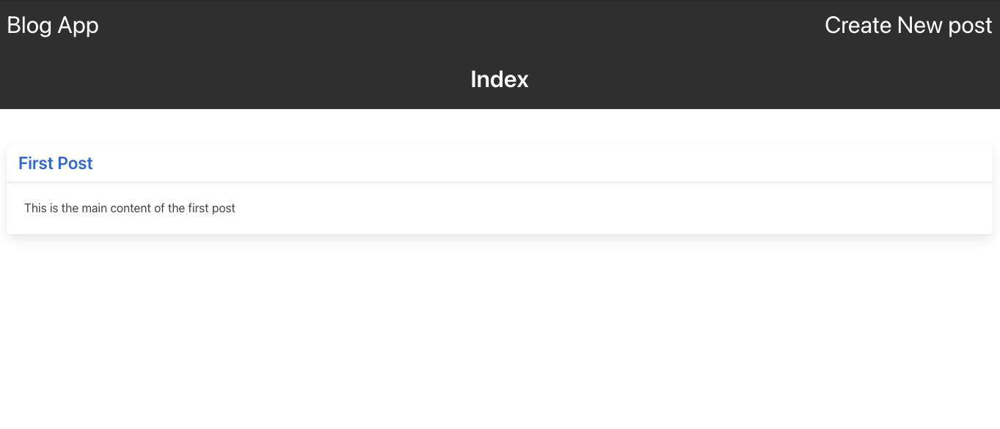

# Blog App

> Blog App. This is a basic blog app built on rails 6.0 this app uses the basic functions. The user is able to create, edit, view and delete a blog post. This is all done following the CRUD based app structure.

## Built With

- Ruby
- Rails
- Heroku

## Live Demo

[Live Demo Link](https://my-firstblog-app.herokuapp.com/)

## Getting Started

To get a local copy up and running follow these simple example steps.

### Prerequisites

- Install [Ruby](https://www.ruby-lang.org/en/)
- Get [Rails](https://rubyonrails.org/)
- Install and create an account on [Heroku](https://www.heroku.com/)

### Setup

- To get a local copy of the project open terminal
- run `git clone https://github.com/uzairali19/blog-app.git`
- Then run `cd blog-app`

### Usage

- You can preview the app from the live heroku server given in the top of the document or:
- To use the app on local machine make sure you are on the root directory `blog-app`
- Open terminal and run `bundle install` to install all the dependecies then run `rails server`
- Get the address on the terminal and paste it on a web browser or simply type `localhost:3000`

### Run tests

To check for any error inside the code:

- Make sure you run `bundle install` first
- Then run `rubocop` to check for any syntactical errors.

## Authors

👤 **Uzair Ali**

- GitHub: [@githubhandle](https://github.com/uzairali19)
- Twitter: [@twitterhandle](https://twitter.com/Uzairali751)
- LinkedIn: [LinkedIn](https://www.linkedin.com/in/uzairali19/)

## 🤝 Contributing

Contributions, issues, and feature requests are welcome!

Feel free to check the [issues page](https://github.com/uzairali19/blog-app/issues/).

## Show your support

Give a ⭐️ if you like this project!

## Acknowledgments

- Inspiration free code camp for elaborating this project for me.

## 📝 License

This project is [MIT](./MIT.md) licensed.
